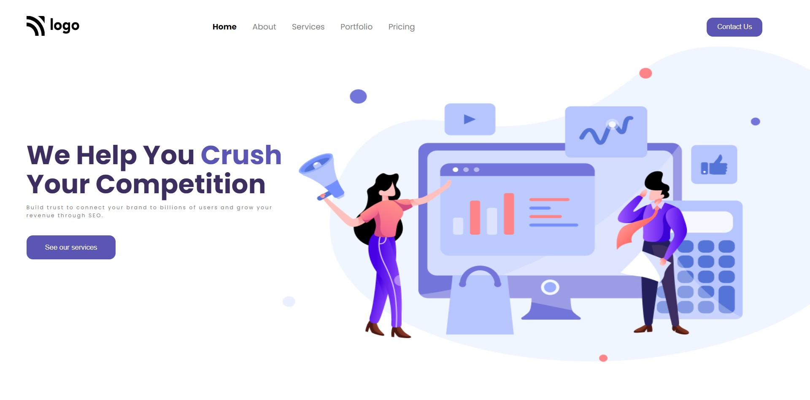

# Project-04 HTML & CSS Full Stack Javascript Web Development Course

## About

This project is created using HTML and CSS. I have used CSS Positioning and flex-box to build this project, and this project is not fully responsive. In future I will try to make it responive.

## ⚙️ What did I learn by making this project?

-   learn CSS postioning in detail.
-   learn to use CSS variables.
-   learn CSS hover effect.

## ⌛ Time taken to finish this project?

This project took me around 1 hour to finish.

## 📷 Screenshots

